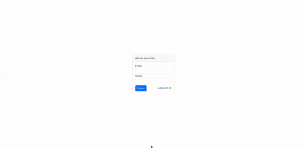

# Login using java :blue_book:

To build the front end of this application, I'm using the Bootstrap framework. It's nothing too fancy, but it's better than letting the browser use the default styles.

## All fields are validated :white_check_mark:

## Doing the login and logout process :white_check_mark:
 

